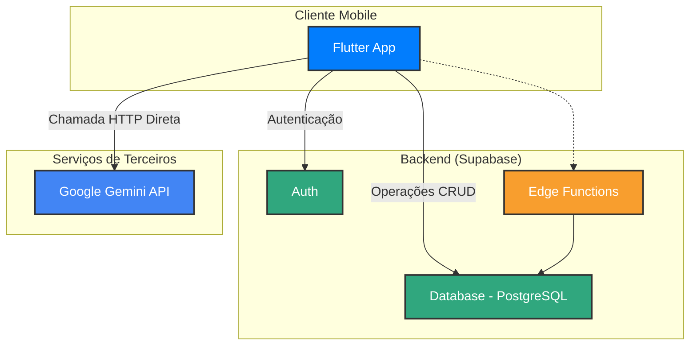
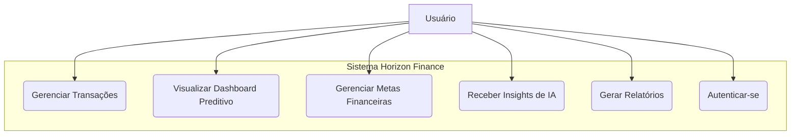
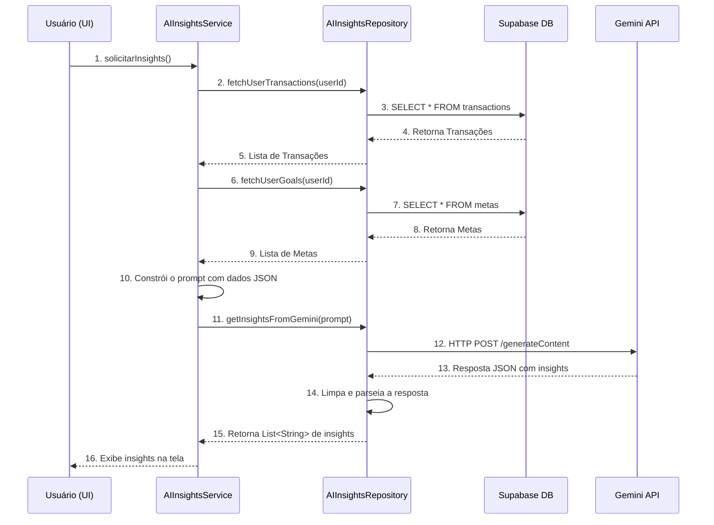
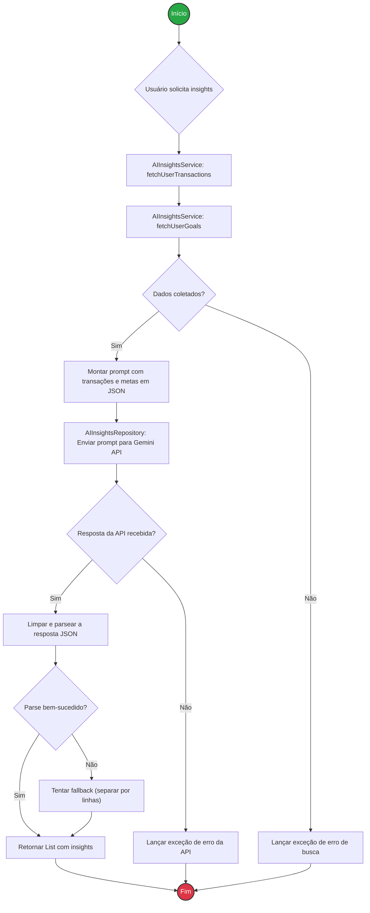

# Documentação Técnica - Horizon Finance

## 1. Resumo Geral do Projeto

O Horizon Finance é uma aplicação mobile de controle financeiro pessoal, desenvolvida em Flutter, com foco em simplicidade, visualização de dados e análise preditiva. O objetivo é reduzir a complexidade e a fricção associadas ao registro de transações financeiras, oferecendo aos usuários uma ferramenta prática para gerenciar suas finanças.

O principal diferencial do projeto é a sua capacidade de fornecer uma visão futura da saúde financeira do usuário. Utilizando a API do Gemini do Google, o aplicativo analisa os hábitos de consumo e receita para gerar projeções de saldo e insights personalizados, ajudando o usuário a tomar decisões mais informadas e a ajustar seu comportamento financeiro para atingir metas.

A arquitetura é baseada em uma stack moderna e de baixo custo, utilizando **Flutter** para o frontend, **Supabase** como Backend-as-a-Service (BaaS) para banco de dados (PostgreSQL) e autenticação, e a **API do Gemini** para as funcionalidades de inteligência artificial.

---

## 2. Detalhamento das Funcionalidades

A aplicação implementa um ciclo completo de gerenciamento financeiro, desde a configuração inicial até a análise avançada.

### a. Autenticação e Onboarding
- **Cadastro e Login**: Usuários podem se registrar e autenticar utilizando e-mail e senha. A gestão é feita pelo serviço de autenticação do Supabase.
- **Onboarding de Despesas Fixas**: Após o primeiro login, o usuário é guiado por uma tela (`despesas_fixas_screen.dart`) para cadastrar suas despesas recorrentes (ex: Aluguel, Assinaturas). Isso alimenta o sistema com dados essenciais para as projeções desde o início.
- **Conclusão do Onboarding**: Ao finalizar o cadastro inicial, o status do usuário é atualizado no banco de dados através do `auth_service.dart`, marcando o onboarding como concluído.

### b. Dashboard Preditivo e Resumo Financeiro
- **Saldo Atual**: O `DashboardService` calcula o saldo total do usuário somando todas as receitas e subtraindo todas as despesas ativas.
- **Projeção de Saldo para 90 Dias**:
    1. O `DashboardService` calcula a média de gastos diários dos últimos 30 dias.
    2. Com base no saldo atual e na média de gastos, ele gera uma lista de `ProjectionPoint` para os próximos 90 dias, usando a fórmula: `SaldoFuturo = SaldoAtual - (MédiaDiária × Dias)`.
    3. Esses pontos são usados para renderizar um gráfico de projeção na tela principal.
- **Resumo do Mês**: O `TransactionService` busca as transações do mês corrente para exibir o total de receitas e despesas mensais no dashboard.

### c. Gerenciamento de Transações (CRUD)
- **Adicionar Transação**: O `TransactionService` permite adicionar transações de `RECEITA` ou `DESPESA`. Ele diferencia transações normais (com `data`) de transações fixas (com `dia_do_mes`).
- **Listar Transações**: O serviço permite buscar todas as transações, as de um período específico ou apenas as últimas para exibição no dashboard.
- **Atualizar Transação**: Permite a edição de qualquer campo de uma transação existente.
- **Excluir Transação (Soft Delete)**: As transações não são removidas fisicamente do banco. Em vez disso, o `deleteTransaction` atualiza o `status` da transação para `INATIVO`, mantendo a integridade do histórico, mas ocultando-a dos cálculos e visualizações.

### d. Processamento de Transações Fixas
- **Inicialização do App**: O `AppInitializer` é executado na inicialização do aplicativo. Ele verifica se as transações fixas do dia já foram processadas.
- **Criação Automática**: Se não foram processadas, o `FixedTransactionService` busca os "templates" de despesas fixas e cria as transações correspondentes para o mês atual, garantindo que despesas como "Aluguel" sejam lançadas automaticamente no dia correto.
- **Processamento Retroativo**: O sistema também verifica e cria transações de meses anteriores que possam não ter sido geradas (ex: se o usuário não abriu o app por um longo período).

### e. Metas Financeiras (CRUD)
- **Criação e Gestão**: O `MetasController` gerencia o ciclo de vida das metas. Os usuários podem criar objetivos financeiros com nome, valor total e data final.
- **Acompanhamento de Progresso**: O usuário pode adicionar valores a uma meta, e o `valorAtual` é atualizado.
- **Lógica de Conclusão e Exclusão**:
    - Ao **excluir** uma meta, o `MetasController` automaticamente cria uma transação de `RECEITA` para devolver o `valorAtual` acumulado ao saldo do usuário.
    - Ao **concluir** uma meta (quando `valorAtual` >= `valorTotal`), se houver valor excedente, ele também é devolvido como uma `RECEITA`. A meta é então marcada como `is_concluded` e `ativo = false`.

### f. Relatórios e Categorias
- **Despesas por Categoria**: O `ReportService` gera um relatório que agrupa todas as despesas de um determinado mês por categoria, somando os valores. Ele processa tanto transações variáveis (com data) quanto as fixas (com dia do mês) para construir o relatório.
- **Listagem de Categorias**: O `category_provider.dart` busca e disponibiliza as categorias de despesa e receita do banco de dados para serem usadas em formulários, como o de adição de transação.

### g. Insights com Inteligência Artificial
- **Geração de Prompt**: O `AIInsightsService` é o orquestrador. Ele busca todas as transações e metas ativas do usuário.
- **Construção do Contexto**: As transações e metas são serializadas para JSON e inseridas em um prompt detalhado, que instrui o modelo Gemini a agir como um analista financeiro. O prompt contém regras estritas sobre o formato da resposta, o tom de voz e os tipos de análise a serem realizados.
- **Chamada à API**: O `AIInsightsRepository` envia o prompt para a API do Gemini através de uma requisição HTTP POST.
- **Processamento da Resposta**: A resposta em texto do Gemini, que deve ser um array JSON, é recebida, limpa de formatações Markdown e parseada para uma lista de strings (`List<String>`), que são os insights exibidos ao usuário.

---

## 3. Padrão de Projeto e Organização do Código

O projeto adota uma **Arquitetura Orientada a Features (Feature-Driven Architecture)** e utiliza o padrão de **Injeção de Dependência** através do Riverpod.

- **Organização**: O código é estruturado dentro do diretório `lib/features`. Cada funcionalidade principal (ex: `transactions`, `ai_insights`, `metas`) possui sua própria pasta, contendo:
    - `services`: Classes que contêm a lógica de negócio e orquestram as operações.
    - `repository` ou `provider`: Classes responsáveis pela comunicação direta com a fonte de dados (neste caso, o Supabase).
    - `models`: Classes de modelo de dados (ex: `Transaction`, `Meta`).
    - `controllers` (para Riverpod): Gerenciam o estado da UI de forma reativa.
    - `screens` ou `widgets`: Componentes da interface de usuário (UI).

- **Gerenciamento de Estado**: **Riverpod** é usado para gerenciar o estado e as dependências.
    - **Provider**: Usado para fornecer instâncias de serviços e repositórios (`TransactionServiceProvider`, `supabaseClientProvider`).
    - **FutureProvider**: Usado para operações assíncronas que carregam dados para a UI, como `categoryListProvider`.
    - **NotifierProvider / AsyncNotifierProvider**: Usado em controllers (`MetasController`) para gerenciar o estado de uma lista de metas, permitindo a manipulação (adicionar, editar, excluir) e reconstruindo a UI automaticamente.

- **Separação de Responsabilidades**:
    - **UI (`screens`)**: Apenas exibe os dados e captura a entrada do usuário.
    - **Services/Controllers**: Contêm a lógica de negócio (o "como fazer").
    - **Repositories**: Abstraem a fonte de dados (o "onde buscar").

---

## 4. Integrações com Serviços Externos

### a. Supabase (Backend-as-a-Service)
- **Conexão**: A integração é feita através do pacote `supabase_flutter`. Uma instância singleton do `SupabaseClient` é inicializada e disponibilizada para toda a aplicação via Riverpod (`supabaseClientProvider`).
- **Autenticação**: O `Supabase.instance.client.auth` é usado para gerenciar o ciclo de vida do usuário (login, cadastro, sessão).
- **Banco de Dados (PostgreSQL)**: Todas as operações de banco de dados (CRUD) são realizadas através de chamadas ao `SupabaseClient`, que constrói e executa queries SQL por baixo dos panos. A segurança é garantida por políticas de **Row Level Security (RLS)** configuradas no Supabase, que asseguram que um usuário só possa acessar os dados associados ao seu `usuario_id`.

### b. Gemini API (Inteligência Artificial)
- **Conexão**: A integração é feita por uma chamada **HTTP POST direta** do cliente Flutter para o endpoint da API do Gemini, conforme implementado no `AIInsightsRepository`.
- **Fluxo de Dados**: O app envia um prompt contendo o histórico financeiro do usuário em formato JSON e recebe de volta uma análise textual, que também é parseada como JSON.

---

## 5. Diagramas Mermaid

### a. Diagrama da Arquitetura do Projeto

### b. Diagrama de Caso de Uso

### c. Diagrama de Sequência (Geração de Insights de IA)

Este diagrama ilustra o fluxo de dados conforme **implementado no código atual**.

### d. Fluxograma da Requisição de Insights

